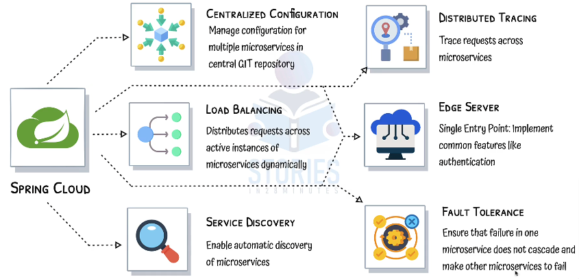

# Java_Spring_Microservices
 
> https://start.spring.io/
> 
> https://mvnrepository.com/
>
> https://springdoc.org/
> 
> http://localhost:8080/swagger-ui/index.html
>
> HAL Explorer
> http://localhost:8080/explorer/index.html#uri=/
>
> http://localhost:8080/h2-console/login.jsp?jsessionid=005b8b284f24d9e1ce8087712111aa31 
> 
> MySQL Docker container
> 
> docker run --detach --env MYSQL_ROOT_PASSWORD=dummypassword --env MYSQL_USER=social-media-user --env MYSQL_PASSWORD=dummypassword --env MYSQL_DATABASE=social-media-database --name mysql --publish 3306:3306 mysql:8-oracle

API Versioning
Static filtering
Dynamic filtering
Monitoring api
Explore API with HAL :  HAL explorer shows HAL links "users/1", "/actuator"


## SPRING SECURITY
maven : spring-boot-starter-security

> http://localhost:8081/login

UserName: user
Password: 2865f423-df69-463d-8fed-ee740a45b11c

else use custom
```
spring.security.user.name= username
spring.security.user.password= password
```

spring security intercepts all requestions and goes thourgh series of filter chain
1) all the requests are authenticated
2) if the request not authenticated, a web page is shown
3) CSRF check that impact POST and PUT request

Configuration file > bean filter chain

## Microservices

#### Spring cloud
* centralized configuration for multiple microservices in a central GIT repo. spring cloud config server

* load balancing > distribute load across active instances of microservices dynamically
* service discovery > enables automatic discovery of microservice. No need to hardcode the URL when a microservice needs to talk to another service. It uses a naming server (EUREKA)
* distributed tracing > trace requests across microservices using zipkin, jager,...
* Edge server > single entry point: implement common features like authentication. using SPRING CLOUD GATEWAY
* fault tolerance > using Resiliance4J


1. Limits Microservice
Ports: 8080, 8081, etc.

2. Spring Cloud Config Server
Port: 8888

3. Currency Exchange Microservice
Ports: 8000, 8001, 8002, etc.

4. Currency Conversion Microservice
Ports: 8100, 8101, 8102, etc.

5. Netflix Eureka Naming Server
Port: 8761

6. API Gateway
Port: 8765

7. Zipkin Distributed Tracing Server
Port: 9411


#### Access config server
* http://localhost:8888/limits-service/default
* http://localhost:8888/limits-service/dev
* http://localhost:8888/limits-service/qa


multiple instances with change in port


